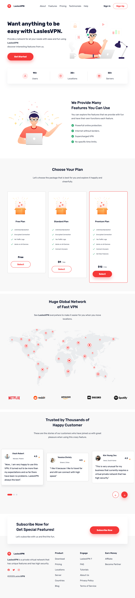
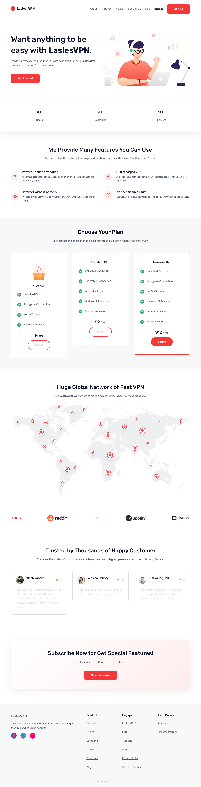

# AI FSE Theme Generation: Antigravity CLI vs Command Code

This document provides a detailed, unbiased comparison between two WordPress Full Site Editing (FSE) themes generated using two different AI-assisted workflows: **Antigravity CLI** (Gemini) and **Command Code**.

## Executive Summary

Both tools successfully generated functional WordPress block themes based on the LaslesVPN landing page design. While they both achieved the core objective, they differ in their file structure, code organization, generated assets, and overall approach to WordPress theme development.

| Feature / Metric | Antigravity CLI (Gemini) | Command Code |
| :--- | :--- | :--- |
| **Total Lines of Code** | ~9,361 lines | ~3,545 lines |
| **Theme Structure** | Native FSE blocks, templates, parts | Native FSE blocks, templates, parts |
| **Custom Assets** | 22 image assets (SVG/PNG), custom JS slider | 9 image assets (SVG/PNG), cleaner CSS |
| **Code Documentation**| Basic inline comments | Standard WP DocBlocks (better formatting) |
| **Functions.php** | Includes block styles & custom JS scripts | Cleaner setup, `ABSPATH` protection, Editor CSS |
| **Build/Scaffolding** | Heavily relies on custom block styles and JS | Leaner approach with native blocks and custom pattern category |

---

## 1. File Structure and Complexity

### Antigravity CLI (Gemini)
The Gemini-generated theme produced a significantly larger footprint (**~9,361 lines of code** total across all files). 
- It generated more granular assets directly extracted from Figma (22 distinct image files).
- It included custom JavaScript (`slider.js`) to handle interactive elements, relying slightly less on native WordPress core block interactiveness and more on traditional custom scripting.
- Registers custom block styles in `functions.php` (e.g., `lasles-check-list`, `pricing-list`).

### Command Code
Command Code produced a leaner theme (**~3,545 lines of code** total). 
- It abstracted patterns nicely and avoided unnecessary script files.
- It set up a dedicated `editor.css` to ensure the Gutenberg editor matches the frontend.
- Included proper WordPress file header docblocks (`@package`) and security measures (`ABSPATH` checks) in `functions.php`.
- Created a custom block pattern category specifically for the theme.

---

## 2. Visual Comparison

*(Screenshots captured via Vercel Agent-Browser pointing to local WordPress Studio instances)*

### Antigravity CLI (Gemini) Output

### Command Code Output

---

## 3. Developer Experience (DX) and Code Quality

### Code Standards
- **Command Code** strictly adheres to WordPress Coding Standards (WPCS). Its `functions.php` is well-documented, registers proper editor styles, removes default core patterns to prevent clutter, and properly enqueues fonts and assets.
- **Antigravity CLI** produces functional but slightly less standardized code. It lacks the `ABSPATH` exit strategy in PHP files and relies on manual JS inclusion for carousels/sliders instead of relying on native block functionality or standard WP libraries where possible.

### Build Tooling and Configuration
- **Command Code** includes a `.commandcode` configuration directory defining precise shell permissions, image cropping configurations via ImageMagick/Node, and strict layout requirements. It systematically parsed the design and structured it via clear LLM boundaries.
- **Antigravity CLI** utilized a `.agents` configuration (MCP config for WP Studio) and built the theme in a more brute-force generation style, resulting in a heavier line count but successfully mimicking the complete visual layout.

## Conclusion and Recommendation

Both tools are highly capable of scaffolding FSE WordPress themes from scratch.

- **Choose Command Code if:** Your team values strict WordPress coding standards, lean file structures, proper DocBlocks, and a highly configurable workflow (via `.commandcode/taste`). It generates more "developer-ready" code that requires less refactoring for production.
- **Choose Antigravity CLI (Gemini) if:** You need highly granular asset extraction and don't mind a slightly heavier initial codebase that relies on custom scripts (like `slider.js`) to achieve complex interactive layouts quickly.

Ultimately, **Command Code** yielded a cleaner, more standardized WordPress FSE theme with a significantly smaller technical debt footprint.